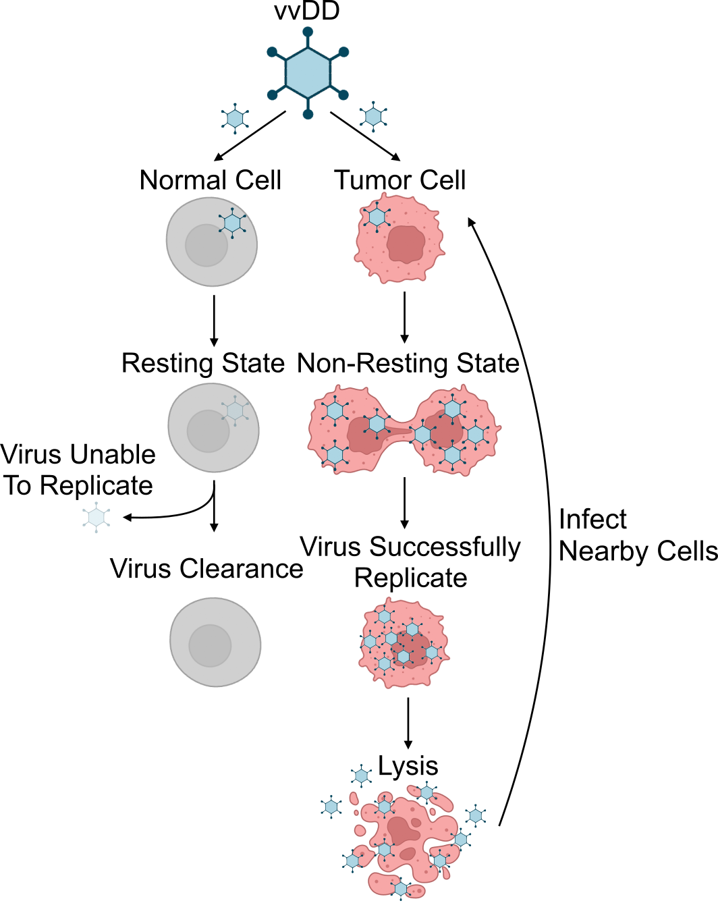

# Parameter Estimation and Model Selection for the Quantitative Analysis of Oncolytic Virus Therapy in Zebrafish Embryos

## Overview
This repository contains the code accompanying the paper, *Parameter Estimation and Model Selection for the Quantitative Analysis of Oncolytic Virus Therapy in Zebrafish Embryos (submitted to IFAC DYCOPS 2025)*

## Requirement


## Tutorial
**Quickstart**
To try one of the models, 

1) first go to the model folder, e.g.:
```
cd individual_based_alternative_model
```
2) run the ... 


## Repository Contents
- **data/**: contains the original tumor volume measurements from [Mealiea et al. (2021)](https://www.nature.com/articles/s41417-020-0194-7.pdf)
- **figure/**: contains figure output from `visualization.ipynb` for each model, e.g. model fits
- **model/**: contains the following three models listed in the paper:
    - baseline model
    - alternative model
    - individual-based alternative model

in each model folder, there are files:

    - `model_creation.py`: create the `.xml` model file
    - `petab_files_creation.ipynb`: build petab files defining the optimization problem
    - `model_optimization.py`: perform optimization 
    - `visualization.ipynb`: visualize the optimization results
    - `check_gradients.ipynb`: double check the gradients of the model

## Contact
If you have any questions, please feel free to contact any of the authors:
- Yuhong Liu (yuhong.liu@uni-bonn.de)
- Dilan Pathirana (dilan.pathirana@uni-bonn.de)
- Jan Hasenauer (jan.hasenauer@uni-bonn.de)

or create an issue